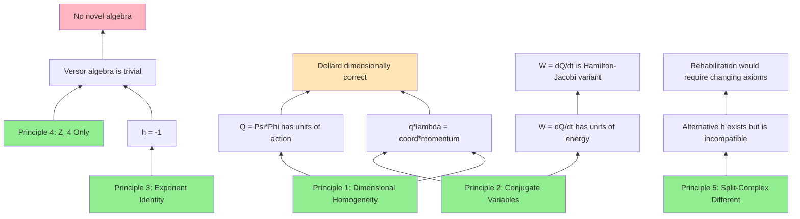

# First Principles Analysis

## Jargon Inventory

| Term | Plain Definition | Novice Proxy Status | Notes |
|------|-----------------|---------------------|-------|
| Action (physics) | Energy multiplied by time; the total "effort" of a physical process | PASSED | Units: joule-seconds (J*s) |
| Lagrangian | Kinetic energy minus potential energy; the function whose integral (action) nature minimizes | PASSED | L = T - V |
| Generalized coordinate | The variable that describes the configuration of a system (position in mechanics, charge in circuits) | PASSED | |
| Conjugate momentum | The "partner" variable to the coordinate; defined as dL/d(coordinate_velocity) | PASSED | Flux linkage in circuits |
| Flux linkage (Psi/lambda) | Voltage accumulated over time; the magnetic flux threading a circuit | PASSED | Units: volt-seconds = Weber |
| Charge (Phi/q) | Current accumulated over time; the total electric charge that has flowed | PASSED | Units: ampere-seconds = Coulomb |
| Hamilton-Jacobi equation | The statement that the time derivative of the action function equals the negative of the Hamiltonian (total energy) | PASSED with caveat | dS/dt = -H relates to Dollard's W = dQ/dt |
| Split-complex number | A number a + bj where j^2 = +1 (not -1); has zero divisors | PASSED | Clifford algebra Cl(1,0) |
| Versor | Dollard's term for an operator in his algebra; in standard math, a unit quaternion | PASSED | Dollard's usage is non-standard |
| Fortescue decomposition | Expressing unbalanced polyphase signals as sums of balanced components; mathematically, DFT | PASSED | Standard since 1918 |
| Z_4 | The cyclic group of order 4; the group of 4th roots of unity {1, i, -1, -i} | PASSED | Dollard's versor algebra |
| Cl(1,0) | The Clifford algebra generated by one element e with e^2 = +1; isomorphic to split-complex numbers | PASSED | What h "wants to be" |

## Novice Proxy Explanations

### Concept 1: Q = Psi * Phi as Action
**12-Year-Old Explanation:**
Action is "energy times time." In circuits, flux (volt-seconds) times charge (ampere-seconds) = joule-seconds = action. Dollard's Q = Psi * Phi is computing the action of an electromagnetic system. This is not new -- it is built into the SI unit system.

**Why This Works:**
The dimensional analysis is exact: [Wb] * [C] = [V*s] * [A*s] = [W*s^2] = [J*s] = [action].

**What It Leaves Out:**
The relationship between this product and the Lagrangian action integral S = integral(L dt) requires more than dimensional analysis -- it requires showing that Dollard's Q is the same integral, not just dimensionally coincident. This is addressed in Principle 2 below.

### Concept 2: W = dQ/dt as Hamilton-Jacobi
**12-Year-Old Explanation:**
If Q measures "total effort" (action), then dQ/dt measures "effort per second" = energy. In advanced physics, the equation "time derivative of action = energy" is called the Hamilton-Jacobi relation. Dollard's W = dQ/dt is a notational variant of this.

**Why This Works:**
The Hamilton-Jacobi equation states dS/dt = -H where H is the Hamiltonian (total energy). If Q plays the role of S (action), then dQ/dt = energy, which is what Dollard calls W.

**What It Leaves Out:**
The sign convention (H = -dS/dt vs W = +dQ/dt) and whether Dollard's Q satisfies the full Hamilton-Jacobi PDE, not just having the right units. Also, H is total energy, not rest energy (E = mc^2), so the "replaces E = mc^2" claim is a category error.

### Concept 3: h = -1 Is Forced
**12-Year-Old Explanation:**
h^1 = -1 means h = -1. Period. There is no algebra where a number raised to the first power gives something other than that number.

**Why This Works:**
In any algebraic structure (group, ring, field, algebra over R), a^1 = a by definition of the identity exponent.

**What It Leaves Out:**
Nothing. This is logically airtight.

## Illusions of Competence

### Illusion 1: "Q = Psi * Phi IS the Action Integral"
**Where Explanation Broke Down:**
Dimensional coincidence is not identity. The action integral S = integral(L dt) is a path integral over a Lagrangian. Dollard's Q = Psi * Phi is a product of two state variables at a single time. These could be related but are not obviously the same object.

**What I Actually Don't Understand:**
- Is Q = Psi * Phi the instantaneous value of the action, or something else?
- In circuit Lagrangian theory, is q * lambda (charge * flux) the generating function of a canonical transformation, Hamilton's principal function, or just a dimensionally-correct product?
- The precise relationship requires: Q = integral(L dt) = integral((1/2)Li^2 - q^2/(2C)) dt. Is this equal to q * lambda for some specific circuit?

**Resolution Attempt:**
In Lagrangian mechanics, the product of a generalized coordinate and its conjugate momentum (q*p) is NOT the action. The action is the integral of the Lagrangian over time. However, the product q*p does appear in:
1. The phase space area (quantum mechanics: delta_q * delta_p >= hbar/2)
2. The generating function of canonical transformations (Hamilton-Jacobi theory)
3. The adiabatic invariant J = integral(p dq) (closed orbits)

For a simple harmonic oscillator (LC circuit), the adiabatic invariant J = integral(lambda dq) over one cycle = energy/frequency = E/f, which has units of J*s = action. So q*lambda is related to but not identical to the Lagrangian action.

**Conclusion**: Q = Psi * Phi is the INSTANTANEOUS product of conjugate variables, which has dimensions of action but is not the Lagrangian action integral. It is more closely related to the adiabatic invariant or the Legendre transform connecting Lagrangian and Hamiltonian. The distinction matters: Dollard's Q is a state function, not a path integral.

## First Principles Foundation

### Principle 1: Dimensional Homogeneity
**Statement:** Physical equations must be dimensionally consistent. Weber * Coulomb = J*s = [action] is a dimensional identity, not a physical discovery.
**Empirical Anchor:** SI unit system, verified by all of electrodynamics.
**Derivation Path:** [Wb] = [V*s], [C] = [A*s], [V*A] = [W] = [J/s], therefore [Wb*C] = [V*s*A*s] = [J*s].

### Principle 2: Conjugate Variables in Circuit Theory
**Statement:** In Lagrangian formulation of circuits, charge q and flux linkage lambda are conjugate variables: q is the generalized coordinate, lambda = dL/d(dq/dt) is the conjugate momentum.
**Empirical Anchor:** Cherry and Miller (1951); standard in Goldstein's Classical Mechanics; used in quantum circuit theory (Josephson junctions).
**Derivation Path:** For an LC circuit, L = (1/2)L_ind * i^2 - q^2/(2C). Then p = dL/d(dq/dt) = dL/di = L_ind * i = lambda (flux linkage). Therefore q and lambda are canonically conjugate.

### Principle 3: The Exponent Identity
**Statement:** In any algebraic structure, a^1 = a. Therefore h^1 = -1 implies h = -1.
**Empirical Anchor:** Definition of exponentiation in any monoid, group, ring, or algebra.
**Derivation Path:** a^1 = a (by definition of raising to the first power). Substituting a = h: h^1 = h. If h^1 = -1, then h = -1.

### Principle 4: Z_4 Is the Only Consistent Interpretation
**Statement:** Given h = -1 and j = i (imaginary unit), the set {1, j, h, k} = {1, i, -1, -i} is Z_4 under multiplication, and there is no other consistent interpretation.
**Empirical Anchor:** Lean 4 formal proof; 1194 N-Phase tests; Cayley table verification.
**Derivation Path:** From Principle 3, h = -1. k = hj = (-1)(i) = -i. So {1, j, h, k} = {1, i, -1, -i}, which is the cyclic group generated by i with i^4 = 1 = Z_4.

### Principle 5: Split-Complex Numbers Are a Different Algebra
**Statement:** The split-complex numbers (Cl(1,0)) have an element j with j^2 = 1, j != +/-1. This satisfies Dollard's h^2 = 1 without h = +/-1, but does NOT satisfy h^1 = -1 (because j^1 = j).
**Empirical Anchor:** Standard Clifford algebra theory (Clifford 1878, Porteous 1995).
**Derivation Path:** Define j by j^2 = 1, j != 1, j != -1. Then j is linearly independent from 1 over R. The algebra R[j]/(j^2 - 1) = Cl(1,0) = split-complex numbers.

## Standard vs. Alternative Methods

### Standard Approach in This Domain:
Lagrangian/Hamiltonian mechanics applied to circuits (Cherry 1951, Chua 1969, modern quantum circuit theory). Phasor analysis for AC. DFT for polyphase decomposition.

### Alternative Methods from Other Domains:

| Source Domain | Method | Potential Application |
|---------------|--------|----------------------|
| Clifford Algebra (Math) | Geometric algebra / spacetime algebra | Could provide a non-trivial interpretation of h as a blade in Cl(p,q) rather than just -1 |
| Category Theory (Math) | Functorial semantics / Kan extensions | Could formalize the relationship between different number systems (C, split-C, quaternions) as functors |
| Quantum Circuit Theory (Physics) | Circuit quantization via flux/charge conjugacy | Directly uses q*lambda as the fundamental relationship; connects Dollard's framework to established quantum physics |
| Signal Processing (EE/CS) | Generalized DFT / harmonic analysis on groups | Could extend Fortescue beyond power systems to arbitrary multichannel data |

## Dependency Map

**Caption**: Green = established principles. Orange = correct but non-novel findings. Red = disproved claims. Dollard's dimensional analysis is correct (follows from Principles 1-2) but his algebraic claims are either trivial (Z_4) or wrong (versor form equivalence).

## Remaining Uncertainties

1. **Q = Psi*Phi vs. the action integral**: I established these are dimensionally identical but not the same mathematical object. Q is a state function; S is a path integral. They may be related through the adiabatic invariant or generating functions, but I cannot prove this without specifying the circuit and trajectory.

2. **Whether Dollard knew about Lagrangian circuit theory**: Did he independently arrive at q*lambda = action, or did he learn it from Steinmetz/Heaviside? This is a historical question I cannot resolve.

3. **The Cl(1,1) rehabilitation**: Could Dollard's framework be made non-trivial by embedding it in Cl(1,1) = {a + be1 + ce2 + de1e2 | e1^2 = 1, e2^2 = -1}? This would give both the split-complex j AND the imaginary i. But this is speculation -- Dollard never proposes it.

## Notes for Next Phase

Visualization should map:
1. The relationship space: {Dollard} -- {Standard Lagrangian} -- {Quantum Circuits} -- {Clifford Algebras}
2. The force field: what drives Dollard's followers toward his framework vs. what resists acceptance
3. The flow: how does correct dimensional analysis get amplified into extraordinary claims?
4. The transition points: where exactly does Dollard go from "correct observation" to "unsupported claim"?
