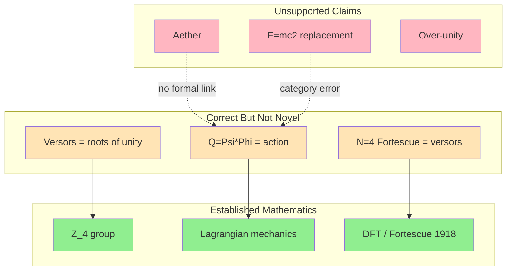
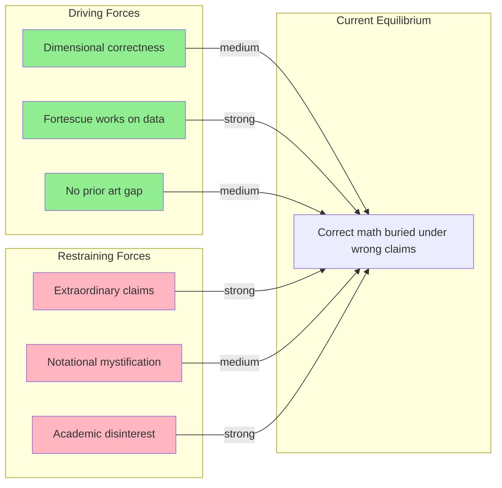
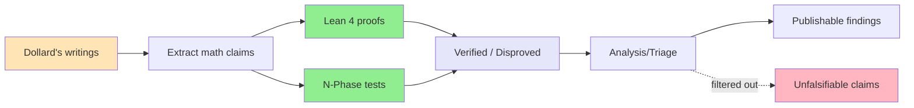
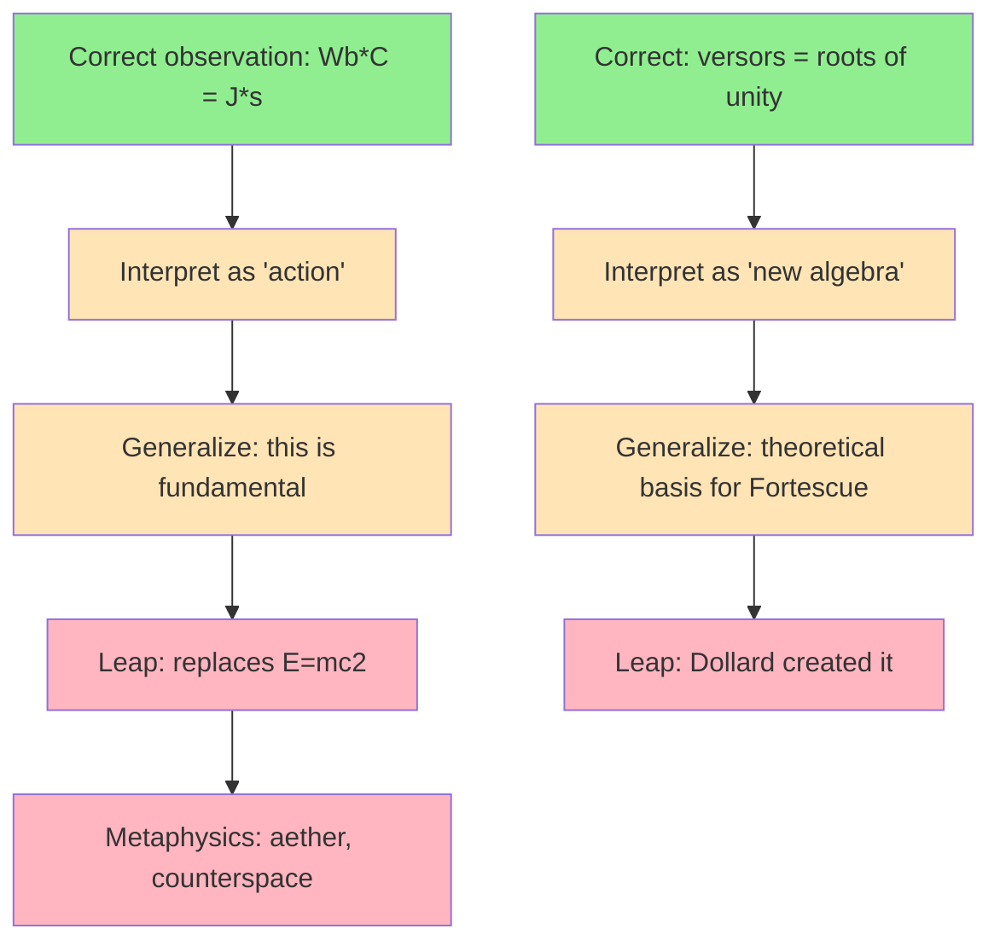

# Field Map Analysis

## System Topology

### Entities

| Entity | Type | Role | Connections |
|--------|------|------|-------------|
| Dollard's versor algebra | Concept | The claimed novel mathematical framework | Z_4, Cl(1,1), Fortescue |
| Z_4 (4th roots of unity) | Concept | The actual algebraic structure Dollard describes | Dollard, DFT, Fortescue |
| Cl(1,1) (split quaternions) | Concept | The non-trivial algebra that "almost" fits Dollard's intent | Dollard (rehabilitated), electromagnetic theory |
| Lagrangian circuit theory | Concept | Standard framework containing q*lambda = action | Dollard's Q=Psi*Phi, Hamilton-Jacobi, quantum circuits |
| Fortescue decomposition | Concept | Standard DFT for polyphase systems (1918) | N-Phase, EE power systems, DFT |
| Lean 4 theorem prover | Actor | Tool for formal verification of mathematical claims | Track A methodology, mathlib |
| N-Phase system | Actor | Computational validation engine (1194 tests) | Fortescue, EEG, power systems |
| Dollard's physics claims | Concept | Unfalsifiable/extraordinary claims (aether, E=mc^2 replacement) | Track C, no formal anchor |

### Spatial Structure

The system has a layered structure: at the bottom, established mathematics (Z_4, Lagrangian mechanics, DFT). In the middle, correct-but-not-novel observations (Q=Psi*Phi has units of action, versors = roots of unity). At the top, unsupported claims (aether, over-unity, E=mc^2 replacement). Dollard's error is conflating layers -- treating middle-layer observations as top-layer discoveries.

**Caption**: Dollard's framework has three layers. Green = established math (bedrock). Orange = correct observations that reduce to known math. Red = extraordinary claims with no formal connection to the correct observations below them. The dashed lines show where Dollard conflates layers.

## Force Field Analysis

### Driving Forces (toward change/acceptance)

| Force | Strength | Source | Direction |
|-------|----------|--------|-----------|
| Dimensional correctness of Q=Psi*Phi | Medium | SI unit system | Gives credibility to Dollard's framework |
| Fortescue works on real data | High | N-Phase experiments (p=0.033, d=3.1) | Validates the math underneath |
| No prior art for formal verification of fringe claims | Medium | Literature gap | Drives Track A publishability |
| Growing interest in formal methods for science | Medium | PhysLib, HepLean, Lean4Physics | Creates receptive audience for methodology |

### Restraining Forces (against acceptance/change)

| Force | Strength | Source | What It Resists |
|-------|----------|--------|-----------------|
| Dollard's extraordinary claims (aether, etc.) | High | Dollard's own writings | Prevents mainstream engagement |
| Notational mystification (h = -1 dressed up) | Medium | Dollard's versor notation | Prevents clear mathematical analysis |
| Academic disinterest in fringe analysis | High | Professional incentives | Prevents Track A publication |
| Cl(1,1) incompatibility with Dollard's axioms | Medium | Mathematical necessity | Blocks non-trivial rehabilitation |

### Force Field Diagram

**Caption**: The system is in an unstable equilibrium. Correct mathematics pushes toward recognition, but extraordinary claims and academic disinterest push back harder. The N-Phase project's empirical results (strong driving force) could tip the balance if divorced from Dollard's claims.

### Tension Points

| Location | Opposing Forces | Current Resolution | Instability Risk |
|----------|-----------------|-------------------|------------------|
| Track A methodology | Genuine novelty vs. academic taboo | Unresolved -- no publication attempt yet | High: could go either way |
| Cl(1,1) rehabilitation | Mathematical richness vs. Dollard's actual axioms | Incompatible -- would require axiom change | Low: clear mathematical answer |
| Fortescue in neuroscience | Promising results vs. no established precedent | N-Phase E007 shows p=0.033 | Medium: needs replication |

## Flow Analysis

### Information Flow

**Caption**: Information flows from Dollard's writings through two verification channels (Lean 4 for formal proof, N-Phase for computational validation) into a triage system. Unfalsifiable claims are filtered out; verified mathematics flows toward publication.

### Causal Flow: How Correct Observations Become Extraordinary Claims

**Caption**: The pattern repeats: correct observation (green) -> reasonable interpretation (yellow) -> overgeneralization (yellow) -> extraordinary leap without evidence (red). The transition from yellow to red is where formal verification has the most impact.

## Phase Transition Analysis

### Current State
The project has verified the mathematical layer (Z_4, telegraph equation) and disproved one claim (versor form equivalence). The dimensional analysis (Q=Psi*Phi) is understood but not yet formally verified. Track A methodology is identified as potentially publishable but untested.

### Potential Transition Points

| Parameter | Current Value | Critical Threshold | Post-Transition State |
|-----------|--------------|-------------------|----------------------|
| Track A publication | Unpublished | Accepted at venue | First formal-verification-of-fringe paper establishes new subfield |
| Fortescue in neuroscience | Single result (p=0.033) | Replicated + mechanism explained | New signal processing paradigm for multichannel data |
| Cl(1,1) investigation | Mathematical analysis complete | Lean proof of incompatibility | Closes Experiment 1 definitively |
| Dollard community engagement | None | Publication reaches community | Could catalyze honest mathematical engagement OR backlash |

### Historical Transitions

The closest historical parallel is the formalization of infinitesimal calculus. Newton and Leibniz used infinitesimals intuitively (correct results, questionable foundations). Bishop Berkeley attacked them ("ghosts of departed quantities"). Robinson's non-standard analysis (1960s) showed infinitesimals could be made rigorous -- not by validating the original informal reasoning, but by constructing a different formal system that happened to produce the same results. Similarly: Dollard's dimensional observations are correct; the question is whether a formal system can be constructed that produces his results without his errors.

## Synthesis: The Field Picture

The field has two attractors:

**Attractor 1 (Standard Math)**: Everything Dollard does reduces to known mathematics. Q=Psi*Phi is dimensional analysis. Versors are Z_4. Polyphase formula is DFT. The "novel" content is zero. This is the current equilibrium.

**Attractor 2 (Genuine Extension)**: There EXISTS a richer algebraic framework (Cl(1,1)) that shares some of Dollard's intuitions (h^2=1, non-trivial h) but requires different axioms. This framework has published applications in electromagnetism. The transition from Attractor 1 to Attractor 2 would require explicitly abandoning Dollard's axioms while preserving his intuitions.

The project's unique contribution is making this distinction PRECISE through formal verification: not "Dollard is wrong" (dismissive) or "Dollard is right" (uncritical), but "Dollard's axioms force triviality; here are the specific axioms that would need to change; here is what the resulting non-trivial algebra looks like."

## Notes for Next Phase

Bisociation should explore:
1. The Cl(1,1) / split-quaternion literature on electromagnetism -- structural parallels
2. Quantum circuit theory (Josephson junctions) as a domain where q*lambda = action is central
3. The history of formalizing informal/intuitive mathematics (Berkeley->Robinson parallel)
4. Signal processing analogies for Fortescue decomposition in non-EE domains
