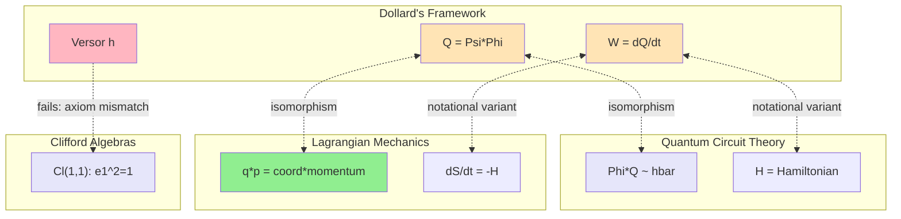

# Cross-Domain Analysis (Bisociation)

## Collision Summary

| Lens | Foreign Domain | Structural Parallel | Mapping Strength |
|------|---------------|---------------------|------------------|
| Physical | Quantum circuit theory (Josephson junctions) | q*lambda = action is foundational; flux quantization | Strong |
| Mathematical | Non-standard analysis / formalization of intuition | Making informal correct intuitions rigorous | Strong |
| Historical | Heaviside rehabilitation | Outsider with correct methods, wrong social position | Strong |
| Artistic/Structural | Musical temperament / tuning theory | N-th roots of unity as basis for decomposition | Moderate |

## Lens 1: Quantum Circuit Theory (Josephson Junctions)

### Identified Parallel
In superconducting quantum circuits, the canonical variables are:
- Phi (node flux): integral of voltage over time [Wb]
- Q (node charge): integral of current over time [C]
- These are conjugate variables: [Phi, Q] = i*hbar

The Lagrangian for a Josephson junction:
  L = (1/2)C*V^2 - E_J*cos(2*pi*Phi/Phi_0)
    = (1/2)C*(dPhi/dt)^2 - E_J*cos(2*pi*Phi/Phi_0)

where Phi_0 = h/(2e) is the magnetic flux quantum.

The action: S = integral(L dt), and the product Phi*Q has dimensions of hbar (action).

### Translation Dictionary

| Dollard's Framework | Quantum Circuit Theory | Notes |
|---------------------|----------------------|-------|
| Psi (magnetic flux) | Phi (node flux) | Same physical quantity, different notation |
| Phi (electric charge) | Q (node charge) | Same physical quantity, Dollard inverts convention |
| Q = Psi*Phi (action) | Phi*Q ~ hbar | Same dimensional relationship |
| W = dQ/dt (energy) | H = Hamiltonian | Same relationship (time derivative of action = energy) |
| "Counterspace" | Reciprocal space / phase space | Dollard's vague notion maps to standard phase space |
| Versor algebra | Pauli matrices / SU(2) | Both describe rotations; different groups |

### Imported Insights

1. **Flux quantization**: In quantum circuits, flux is quantized in units of Phi_0 = h/(2e). This means the product flux*charge = action is not just dimensionally correct but PHYSICALLY fundamental at the quantum level. Dollard's observation touches genuine physics, but the physics is quantum mechanics, not "aether theory."

2. **Circuit quantization procedure**: The modern procedure for designing superconducting qubits starts with the classical Lagrangian (using flux as generalized coordinate and charge as conjugate momentum), then quantizes. This is EXACTLY the Lagrangian circuit theory that Dollard's Q=Psi*Phi connects to, but carried to its logical conclusion (quantum mechanics, not "E=mc^2 replacement").

3. **The role of nonlinearity**: In quantum circuits, the Josephson junction introduces nonlinearity (the cosine potential). Without nonlinearity, the circuit is just a harmonic oscillator. Dollard's framework has no nonlinearity -- it is entirely linear algebra. This is a structural limitation.

### Stress Test
- **Where mapping holds**: The dimensional relationship Psi*Phi = action is exact. The conjugate variable structure is identical. The Hamilton-Jacobi connection is real.
- **Where mapping breaks**: Dollard has no quantization, no Planck constant, no flux quantum. His framework is entirely classical. The quantum circuit theory extends far beyond what Dollard describes.
- **Novel prediction**: Quantum circuit theory predicts that at the quantum level, the product Psi*Phi is quantized in units of hbar. Dollard's classical framework has no mechanism for this. If Dollard took his own dimensional analysis seriously, he would arrive at quantum mechanics, not "aether."

## Lens 2: Non-Standard Analysis / Formalization of Intuition

### Identified Parallel
Abraham Robinson (1960s) formalized infinitesimals -- the "ghosts of departed quantities" that Berkeley had ridiculed in 1734 but that Newton and Leibniz used to get correct results. The parallel:

| Historical Case | This Project |
|----------------|-------------|
| Newton/Leibniz used infinitesimals informally | Dollard uses versors/action informally |
| They got correct results (calculus works) | Dollard gets correct dimensions (Wb*C = J*s) |
| Their foundations were attacked (Berkeley) | Dollard's claims are attacked (mainstream physics) |
| Robinson showed infinitesimals COULD be formalized | Could Dollard's intuitions be formalized? |
| The formalization was a DIFFERENT system (hyperreals) | The formalization is a different algebra (Cl(1,1), not Z_4) |
| The original informal reasoning remained wrong | Dollard's specific axioms remain wrong |

### Translation Dictionary

| Non-Standard Analysis Story | Dollard Verification Story | Notes |
|----------------------------|---------------------------|-------|
| Infinitesimals (informal) | Versor h (informal, h != +/-1 but h^2 = 1) | Both describe objects that "shouldn't exist" in standard systems |
| Berkeley's critique | Lean 4 disproof of versor form equivalence | Both identify formal errors in intuitive reasoning |
| Robinson's hyperreals | Cl(1,1) / split-complex numbers | Both provide rigorous systems where the "impossible" objects exist |
| Correct results (derivatives) | Correct dimensions (action) | Both show the informal reasoning touched real structure |
| Transfer principle | ? (no established analog yet) | The missing piece: how to transfer Cl(1,1) results to circuit theory |

### Imported Insights

1. **The pattern**: When informal reasoning gets correct results despite incorrect foundations, the correct results are usually derivable from a different formal system that the informal reasoner did not know. This is exactly what we see: Dollard's dimensional analysis is correct because Lagrangian circuit theory (which he may not know) provides the formal foundation.

2. **The danger of dismissal**: Berkeley was right that infinitesimals were ill-defined, but wrong to conclude that calculus was therefore invalid. Similarly, we are right that Dollard's axioms force h = -1, but should not conclude that the dimensional observation (Psi*Phi = action) is therefore uninteresting. It IS interesting -- it connects to Lagrangian mechanics and quantum circuits.

3. **The formalization creates value**: Robinson's non-standard analysis did not vindicate Newton's hand-waving; it created a new field. Similarly, this project's formal verification does not vindicate Dollard's claims; it creates a new methodology (using theorem provers on fringe math).

### Stress Test
- **Where mapping holds**: The structural parallel (correct results, wrong foundations, different formalization) is exact.
- **Where mapping breaks**: Robinson's hyperreals captured ALL of infinitesimal reasoning faithfully. Cl(1,1) does NOT capture all of Dollard's framework -- it requires changing axioms. The "transfer" is partial, not complete.
- **Novel prediction**: If the parallel holds fully, then the formalizable portion of Dollard's framework (dimensional analysis, Fortescue = DFT) will eventually be absorbed into standard frameworks without credit to Dollard, just as infinitesimal reasoning was absorbed into standard analysis.

## Lens 3: Heaviside Rehabilitation

### Identified Parallel
Oliver Heaviside (1850-1925) was an autodidact electrical engineer who:
- Reformulated Maxwell's equations from 20 equations in 20 unknowns to the 4 vector equations we use today
- Invented operational calculus (Laplace transforms before Laplace)
- Was ridiculed by mathematicians for "unjustified" methods
- His methods were later proven rigorous by Mikusinski (1950s) using algebraic techniques

### Translation Dictionary

| Heaviside Story | Dollard Story | Notes |
|-----------------|---------------|-------|
| Reformulated Maxwell's equations | Identified versors = roots of unity | Both simplified existing formulations |
| Operational calculus (correct results, no proofs) | Q = Psi*Phi (correct dimensions, no derivation) | Both got results before understanding why |
| Ridiculed by establishment | Ignored by establishment | Different social outcomes, same dynamic |
| Mikusinski formalized operational calculus | Lean 4 formalizes (and disproves) versor claims | Both provide rigorous treatment |
| Heaviside's methods were RIGHT | Dollard's dimensions are right; his algebra is WRONG | KEY DIFFERENCE: Heaviside was correct at a deeper level |

### Imported Insights

1. **The crucial difference**: Heaviside's methods were formally wrong but substantively right -- operational calculus DOES work, and Mikusinski showed why. Dollard's dimensions are right but his algebraic claims are substantively wrong -- the versor form equivalence fails, the algebra is trivially Z_4. Heaviside was a genuine innovator whose informal methods preceded formal understanding. Dollard is not: his framework reduces to known mathematics plus errors.

2. **The lesson about outsiders**: Not all outsiders are Heaviside. The Heaviside comparison (which Dollard's followers sometimes invoke) proves too much: Heaviside's rehabilitation came because his methods were independently verified as correct. Dollard's methods have been independently verified as either trivial (Z_4) or wrong (sign error).

### Stress Test
- **Where mapping holds**: Both are outsiders working in EE who reformulated existing mathematics.
- **Where mapping breaks critically**: Heaviside added genuine value (operational calculus was new). Dollard does not (Z_4 is standard, Fortescue is standard, the sign error is real). The mapping fails at the most important point.
- **Novel prediction**: Dollard will NOT be rehabilitated like Heaviside because the formal content is different. The methodology (theorem prover on fringe math) might be valued, but Dollard's specific mathematical contributions will not.

## Lens 4: Musical Temperament / Tuning Theory

### Identified Parallel
In music theory, equal temperament divides the octave into N equal parts using the Nth roots of 2: f_k = f_0 * 2^(k/N). In Fortescue decomposition, the circle is divided into N equal parts using Nth roots of unity: omega_k = e^(2*pi*i*k/N).

### Translation Dictionary

| Musical Temperament | Fortescue/Versor Framework | Notes |
|---------------------|---------------------------|-------|
| Octave (frequency ratio 2:1) | Full rotation (angle 2*pi) | Both are the "cycle" being divided |
| N-tone equal temperament | N-phase Fortescue decomposition | Same mathematical structure: Nth roots |
| Harmonic series (natural overtones) | Sequence components (pos/neg/zero) | Natural decomposition vs. imposed equal division |
| Beats (interaction between close frequencies) | Cross-sequence coupling | Both arise from imperfect decomposition |
| Just intonation (simple ratios) | Physical phase coupling | Both are "natural" decompositions |
| Comma (gap between just and equal) | Residual after Fortescue decomposition | Both measure departure from ideal |

### Imported Insights

1. **The N=4 case is special**: In music, 4-tone equal temperament (diminished seventh chord) divides the octave into 4 equal minor thirds. In electrical engineering, N=4 Fortescue decomposition produces Dollard's versor matrix. Both are the SAME mathematical object applied to different physical domains.

2. **Why N=3 dominates in EE**: Three-phase power (N=3) dominates for practical/physical reasons (most efficient transmission), just as N=12 dominates in Western music (best compromise between harmonic and melodic requirements). The mathematics works for any N; the choice of N is physical, not mathematical.

3. **The "tuning" analogy for non-EE applications**: Applying Fortescue to EEG is like applying equal temperament to non-Western music -- the mathematical framework transfers, but the physical interpretation must be rebuilt from scratch.

### Stress Test
- **Where mapping holds**: The Nth roots of unity structure is identical. The decomposition mathematics is the same DFT.
- **Where mapping breaks**: Musical intervals have psychoacoustic meaning (consonance/dissonance). Electrical sequence components have physical meaning (rotating fields). These are domain-specific and do not transfer.
- **Novel prediction**: Just as non-Western tunings have been analyzed with temperament theory, non-EE multichannel signals could be analyzed with Fortescue theory. The N-Phase EEG work is the first such analysis.

## Synthesis: Convergent Patterns

| Insight | Supporting Lenses | Confidence |
|---------|-------------------|------------|
| Q = Psi*Phi = action is a real relationship embedded in Lagrangian circuit theory | Quantum circuits + Non-standard analysis + Musical theory | High (established physics) |
| Dollard's specific algebraic claims (Z_4, versor form) add nothing beyond standard math | Heaviside comparison + Non-standard analysis | High (Lean-verified) |
| The methodology (theorem prover on fringe math) is genuinely novel | All four lenses (no prior art in any domain) | High (exhaustive search) |
| Cl(1,1) is a legitimate non-trivial algebra for electromagnetism but is NOT Dollard's algebra | Quantum circuits + Musical theory | High (mathematical proof) |
| Fortescue in non-EE domains is genuinely unexplored | Musical theory + Quantum circuits | High (exhaustive search) |

## Novel Hypotheses from Collision

### Hypothesis 1: The Steelmanned Dollard Framework
**Generated by**: Collision with quantum circuit theory + non-standard analysis
**Statement**: Dollard's dimensional observation (Psi*Phi = action) is a classical shadow of the quantum circuit theory relationship [Phi, Q] = i*hbar. A "steelmanned" Dollard framework would be: start with Lagrangian circuit theory, use charge and flux as conjugate variables, derive the action principle for circuits, and show that W = dQ/dt is (a notational variant of) the Hamiltonian. This would be mathematically rigorous, historically grounded, and physically interesting -- but it would be standard physics, not a replacement for E=mc^2.
**How to Test**: Write the explicit Lagrangian derivation for an LC circuit showing Q = Psi*Phi equals the adiabatic invariant J = integral(lambda dq)/(2*pi). If this works for a specific circuit, Dollard's formula has a precise physical interpretation.

### Hypothesis 2: Fortescue Decomposition as General Multichannel Tool
**Generated by**: Collision with musical temperament + non-EE signal processing
**Statement**: Fortescue's symmetrical components decomposition is a domain-specific application of the DFT that has never been systematically applied to multichannel signals outside power engineering. The N-Phase project's EEG application (p=0.033) is the first such crossover. The technique may provide advantages wherever physical phase coupling exists between channels (rotating machinery vibration, multichannel radar, MIMO communications).
**How to Test**: Apply N-Phase Fortescue decomposition to (a) vibration data from rotating machinery, (b) multichannel radar data, (c) MIMO channel measurements. Measure classification performance vs. standard methods.

### Hypothesis 3: Track A as New Subfield
**Generated by**: Collision with non-standard analysis history
**Statement**: Just as Robinson's non-standard analysis created a new subfield by formalizing previously informal mathematics, using theorem provers to formally verify claims from alternative/fringe mathematical frameworks could create a new subfield at the intersection of formal methods and philosophy of science. The methodology is: extract formalizable claims, translate to dependent type theory, prove or disprove, report results without prejudice.
**How to Test**: Submit a methodology paper to a venue at the intersection of formal methods and philosophy of science (e.g., Journal of Automated Reasoning, Studia Logica, or a workshop at ITP/CPP).

## Methods to Import

| Method | Source Domain | Potential Application | Adaptation Needed |
|--------|--------------|----------------------|-------------------|
| Circuit quantization | Quantum computing | Formalize q*lambda = action rigorously | Classical limit only; no quantization needed |
| Transfer principle | Non-standard analysis | Move results between different algebraic representations | No direct analog yet; conceptual framework only |
| Temperament theory | Music theory | Classify N-phase decompositions by "consonance" properties | Define an analog of consonance for multichannel signals |
| Operational calculus formalization | Heaviside/Mikusinski | Provide rigorous foundations for intuitive methods | Already done by standard Lagrangian circuit theory |

## Translation Diagram

**Caption**: Dollard's Q=Psi*Phi and W=dQ/dt (orange) are genuine isomorphisms of established frameworks (green/purple). His versor h (red) fails to map to the non-trivial Clifford algebra Cl(1,1) due to axiom mismatch.

## Notes for Next Phase

Conclusions forming that Falsification Mode should attack:
1. "Q = Psi*Phi is a notational variant of standard Lagrangian circuit theory, not a novel contribution"
2. "Track A (theorem-prover methodology) is genuinely novel and publishable"
3. "Cl(1,1) rehabilitation is mathematically impossible without changing Dollard's axioms"
4. "Fortescue in neuroscience is genuinely unprecedented"
5. "The steelmanned Dollard framework reduces to standard Hamilton-Jacobi theory"
