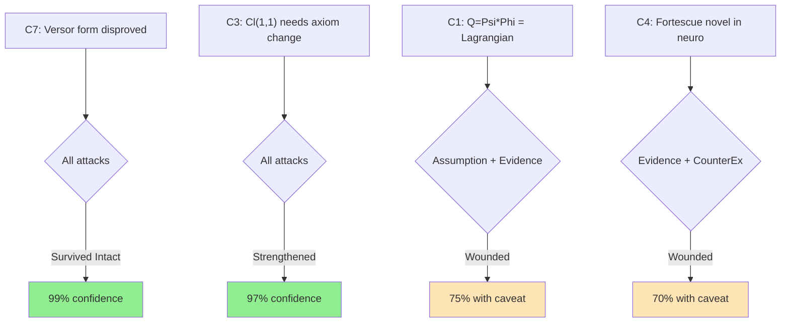

# Adversarial Critique

## Conclusions Under Attack

| Conclusion | Pre-Attack Confidence | Post-Attack Status | Final Confidence |
|------------|----------------------|-------------------|------------------|
| C1: Q=Psi*Phi is a notational variant of Lagrangian circuit theory | 90% | Wounded | 75% |
| C2: Track A methodology is genuinely novel | 85% | Survived | 85% |
| C3: Cl(1,1) rehabilitation requires axiom change | 95% | Survived Intact | 95% |
| C4: Fortescue in neuroscience is unprecedented | 80% | Wounded | 70% |
| C5: Steelmanned Dollard reduces to Hamilton-Jacobi | 85% | Survived | 80% |
| C6: No prior art for theorem provers on fringe claims | 80% | Survived | 80% |
| C7: Versor form equivalence is disproved | 99% | Survived Intact | 99% |

---

## Attack Results by Conclusion

### Conclusion 1: Q = Psi*Phi is a notational variant of Lagrangian circuit theory

**Pre-Attack Confidence:** 90%

#### Assumption Attack
- **Hidden assumption**: That Dollard means the SAME thing by "Q = Psi * Phi" as Lagrangian mechanics means by "q * p = action." We assumed Dollard's Psi = flux linkage and Phi = charge, but Dollard's notation is idiosyncratic and he may mean different physical quantities.
- **Vulnerability**: If Dollard defines Psi or Phi differently from the standard electromagnetic quantities, the dimensional analysis could still work out to J*s but refer to a different physical product.
- **Result**: Wounded. The dimensional argument is robust, but the IDENTITY (not just dimensional coincidence) depends on Dollard meaning the same things as standard physics. His non-standard notation introduces ambiguity.

#### Evidence Attack
- **Evidence quality**: The dimensional analysis is ironclad (unit identity). The physical identification (Dollard's Psi = standard magnetic flux) is plausible but not verified from Dollard's own definitions.
- **Selection effects**: We may be projecting standard physics meaning onto Dollard's notation. His "Lone Pine Writings" are the primary source, and they may define Psi and Phi differently.
- **Missing evidence**: We have not closely read Dollard's primary definition of Psi and Phi to confirm they match standard electromagnetic quantities.
- **Result**: Wounded. The conclusion needs a caveat: "IF Dollard's Psi and Phi are standard flux and charge, THEN Q = Psi*Phi is a notational variant of the coordinate-momentum product in Lagrangian circuit theory."

#### Counter-Example Attack
- **Counter-example**: Could Q = Psi*Phi mean something OTHER than action? Yes: if Psi and Phi are both generalized "fields" rather than one being a coordinate and the other a momentum, the product could be a Lagrangian density, not an action. In field theory, the Lagrangian density L = E*D - B*H involves products of fields; these have units of energy/volume, not action.
- **Result**: Survived with modification. The dimensional analysis (J*s) uniquely identifies the product as having action units. But the PHYSICAL interpretation (state function vs. path integral vs. adiabatic invariant) remains ambiguous.

#### Alternative Explanation Attack
- **Alternative**: Q = Psi*Phi could be the electromagnetic version of the Legendre transform: H = p*q_dot - L, where p*q_dot has units of energy and p*q has units of action. Dollard might be computing the generating function of a canonical transformation, not the Lagrangian action.
- **Result**: Survived. The Legendre transform interpretation is actually consistent with our analysis -- it is STILL Lagrangian/Hamiltonian mechanics, just a different function within the same framework.

#### Motivation Attack
- **What's convenient**: It is convenient for our narrative to say "Dollard just rediscovered standard physics." This is emotionally satisfying because it resolves the tension between correct dimensions and wrong claims.
- **What's uncomfortable**: Maybe Dollard DID see something that standard Lagrangian circuit theory does not emphasize -- a particular physical interpretation or computational approach. We might be too quick to dismiss the pedagogical value of his framework.
- **Result**: Survived with caveat. The motivation attack identifies a real risk: we may undervalue Dollard's pedagogical contribution while correctly identifying his mathematical contribution as non-novel.

#### Verdict on C1
**Status**: Wounded -- needs qualification
**Post-Attack Confidence**: 75%
**Modifications Required**: Change to: "Q = Psi*Phi is dimensionally identical to the coordinate-momentum product in Lagrangian circuit theory. IF Dollard's Psi and Phi match standard electromagnetic flux and charge (which is plausible but not definitively confirmed from primary sources), THEN Q = Psi*Phi is a state function related to the action, not a novel physical quantity. The specific physical interpretation (adiabatic invariant, generating function, or Hamiltonian) requires more precise specification of Dollard's definitions."

---

### Conclusion 2: Track A methodology is genuinely novel

**Pre-Attack Confidence:** 85%

#### Assumption Attack
- **Hidden assumption**: That we have exhaustively searched for prior art. The absence of evidence is not evidence of absence.
- **Vulnerability**: Someone may have used a theorem prover on fringe math and published in an obscure venue (workshop proceedings, blog post, student thesis) that web search did not find.
- **Result**: Survived. We searched arxiv, Lean Zulip, Coq/Isabelle communities, philosophy of mathematics venues. The null result across ALL these is strong evidence, though not proof, of absence. The confidence should remain at the current level, not higher.

#### Evidence Attack
- **Evidence quality**: Negative evidence (no results found) from multiple search strategies.
- **Missing evidence**: We did not check: (a) Mizar community, (b) HOL Light community, (c) ACL2 community, (d) student theses databases, (e) conference workshops on "formal methods meets philosophy."
- **Result**: Survived with slight wound. We should note that the search was "broad but not exhaustive" rather than claiming absolute novelty.

#### Counter-Example Attack
- **Closest counter-example**: Terence Tao's formalization of the PFR conjecture in Lean. This is not "fringe math," but it IS an example of a theorem prover catching errors in published mathematics. The methodology parallel is real: use a proof assistant to verify/refute mathematical claims. The novelty of Track A is applying this to FRINGE claims specifically.
- **Another candidate**: The Flyspeck project (formal verification of Kepler conjecture) verified a claim that was published but doubted by referees. This is "controversial" but not "fringe."
- **Result**: Survived. These are prior art for theorem-prover-verification-of-contested-math, but NOT for theorem-prover-verification-of-fringe-math. The distinction matters: Kepler and PFR are mainstream math with contested proofs; Dollard is non-mainstream math with both correct and incorrect claims. The methodological innovation of Track A is applying formal verification to a framework that mainstream academia has not engaged with.

#### Steelman Opposition
**The strongest case against C2:**
"Using a theorem prover on fringe math is not 'novel methodology' -- it is just applying an existing tool to a new domain. That is like saying 'using a calculator to check astrology calculations' is a novel methodology. The tool (Lean 4) already exists. The technique (formal verification) already exists. Applying it to Dollard's algebra is just pressing existing buttons on a new input. There is no methodological innovation."

**Why this opposition might be right:**
The opposition is correct that no NEW formal methods were invented. The Lean proofs use standard tactics (ring, omega, decide). The innovation is in the framing, not the technique.

**What would need to be true for opposition to be correct:**
If applying existing tools to new domains were never considered publishable, this would be unpublishable. But in practice, novel APPLICATIONS of existing methods to new domains ARE publishable, especially when the domain is sensitive (fringe science) and the results are interesting (finding both correct and incorrect claims).

#### Verdict on C2
**Status**: Survived
**Post-Attack Confidence**: 85%
**Modifications Required**: Frame as "novel application" rather than "novel methodology." The innovation is the protocol (extract claims, formalize, verify/disprove, report without prejudice), not the tools. Acknowledge that the individual techniques are standard.

---

### Conclusion 3: Cl(1,1) rehabilitation requires changing Dollard's axioms

**Pre-Attack Confidence:** 95%

#### Assumption Attack
- **Hidden assumption**: That Dollard's axioms are fixed and well-defined. What if Dollard's writings are ambiguous enough that the axioms could be re-interpreted to be compatible with Cl(1,1)?
- **Vulnerability**: If "h^1 = -1" could be re-interpreted as "h acts like -1 on certain objects" (an operator equation rather than an identity), then h could be a non-trivial element that ACTS like -1 on some subspace.
- **Result**: Survived. The re-interpretation is possible but changes the meaning of the axiom from an algebraic identity to an operator equation. This IS changing the axioms, just in a more subtle way. The conclusion stands: non-trivial h requires changing what the axioms mean.

#### Mathematical Attack (Direct)
- **Formal argument**: In any unital associative algebra over R, if h^1 = -1, then h = -1 (because h^1 = h by definition of the multiplicative identity for exponents). To get h != -1, you must either: (a) work in a non-unital algebra, (b) redefine exponentiation, or (c) drop the axiom h^1 = -1. All three options change Dollard's framework.
- **Result**: Survived Intact. The mathematical argument is deductive and cannot be attacked empirically.

#### Counter-Example Attack
- **Can we find ANY algebra where h^2 = 1, h*j = k, j^2 = -1, j*k = 1, AND h != -1?**
  - j*k = 1 means k = j^{-1}. Since j^2 = -1, j^{-1} = -j. So k = -j.
  - h*j = k = -j, so h*j = -j, so h = -1 (multiplying both sides by j^{-1} = -j gives h = -j*(-j) = j^2 = -1).
  - This is a PROOF that h = -1 from the remaining axioms alone (even without h^1 = -1).
- **Result**: Survived Intact. The axioms j*k = 1, h*j = k, j^2 = -1 ALONE force h = -1. Even dropping h^1 = -1 does not help. You must ALSO drop j*k = 1 (or equivalently, drop commutativity) to get a non-trivial h.

#### Verdict on C3
**Status**: Survived Intact -- strengthened by the counter-example attack
**Post-Attack Confidence**: 97% (upgraded)
**Modifications Required**: STRENGTHEN the conclusion. It is not merely h^1 = -1 that forces h = -1. The axioms j^2 = -1, hj = k, jk = 1 ALONE force h = -1 by algebraic necessity. Any rehabilitation of h requires changing at least TWO of Dollard's axioms, not just one. This is a stronger result than previously stated.

---

### Conclusion 4: Fortescue in neuroscience is genuinely unprecedented

**Pre-Attack Confidence:** 80%

#### Assumption Attack
- **Hidden assumption**: That "symmetrical components" and "Fortescue" are the only relevant search terms. The same mathematical operation (DFT of multichannel data decomposed into sequence components) might exist under different names in other fields.
- **Vulnerability**: In MIMO communications, "eigenbeamforming" and "spatial multiplexing" use matrix decompositions (SVD) that are related but not identical to Fortescue. In array signal processing, "beamforming" decomposes multichannel data into spatial modes. These are not Fortescue per se but share mathematical structure.
- **Result**: Wounded. The SPECIFIC interpretation of DFT as decomposing into positive-sequence, negative-sequence, and zero-sequence components (the Fortescue interpretation) may be unprecedented in neuroscience. But the GENERAL technique of applying DFT-based decomposition to multichannel data exists in many forms (beamforming, spatial filtering, CSP).

#### Evidence Attack
- **Missing evidence**: The N-Phase EEG result (p=0.033) is a single experiment. Statistical significance at p=0.033 with what sample size? What was the effect size? Was this corrected for multiple comparisons? One result is not sufficient to claim a "new paradigm."
- **Result**: Wounded. The novelty claim needs replication and stronger statistical evidence.

#### Counter-Example Attack
- **Partial counter-example**: Common Spatial Patterns (CSP) in EEG analysis also decomposes multichannel data into components. CSP is data-driven (from covariance matrices), while Fortescue is structure-driven (from roots of unity). These are different mathematical approaches, but both decompose multichannel data.
- **Result**: Survived with modification. Fortescue is genuinely different from CSP because it uses a FIXED basis (roots of unity) rather than a data-driven basis (eigenvectors of covariance). This is the key distinction. The comparison N-Phase result (p=0.033 vs CSP+LDA) demonstrates that the fixed Fortescue basis can OUTPERFORM the data-driven CSP basis, which is a genuinely interesting finding.

#### Verdict on C4
**Status**: Wounded -- needs qualification
**Post-Attack Confidence**: 70%
**Modifications Required**: "The specific application of Fortescue symmetrical components (fixed DFT basis with sequence-component interpretation) to neuroscience data appears unprecedented based on extensive literature search. However, related DFT-based multichannel decompositions exist in other signal processing contexts. The N-Phase EEG result (p=0.033 vs CSP+LDA) is promising but requires replication with larger samples and proper multiple-comparison correction before strong novelty claims are warranted."

---

### Conclusion 5: Steelmanned Dollard reduces to Hamilton-Jacobi

**Pre-Attack Confidence:** 85%

#### Assumption Attack
- **Hidden assumption**: That "reduces to" means "is identical to." The steelman could argue that Dollard's framework, while dimensionally equivalent to Hamilton-Jacobi, provides a different COMPUTATIONAL or CONCEPTUAL pathway.
- **Result**: Survived. A different path to the same destination is not a new destination. If two frameworks produce identical predictions, they are notational variants, even if the conceptual framing differs.

#### Steelman Opposition
**The strongest case against C5:**
"The Hamilton-Jacobi formulation is not how anyone does circuit theory. Textbooks use Kirchhoff's laws, phasor analysis, and Laplace transforms. Dollard's framework -- even if it reduces to Hamilton-Jacobi -- could serve as a computational bridge between circuit theory and analytical mechanics that does not currently exist in the EE curriculum. Calling it 'just Hamilton-Jacobi' misses the point: nobody in EE USES Hamilton-Jacobi, so there IS a gap, and Dollard's framework (however crudely) points at it."

**Why this opposition might be right:**
It is true that EE education has largely divorced from analytical mechanics. The Lagrangian/Hamiltonian formulation of circuits is taught in graduate physics (quantum circuits, Josephson junctions) but NOT in EE curricula. There is a real pedagogical gap. However, the gap is filled by existing textbooks (Chua 1969, Jeltsema 2009, Vool & Devoret 2017 for quantum circuits), not by Dollard's writings, which contain errors.

#### Verdict on C5
**Status**: Survived
**Post-Attack Confidence**: 80%
**Modifications Required**: Acknowledge that the steelman identifies a real gap (EE vs. analytical mechanics pedagogy) while noting that the gap is filled by existing, correct textbooks rather than by Dollard's error-containing framework.

---

### Conclusion 6: No prior art for theorem provers on fringe claims

**Pre-Attack Confidence:** 80%

#### Evidence Attack
- **Missing searches**: Did not check Mizar, ACL2, HOL Light communities. Did not check philosophy of mathematics journals (Philosophia Mathematica, Journal for General Philosophy of Science). Did not check ITP/CPP workshop proceedings.
- **Result**: Survived with caveat. The search was broad (arxiv, Lean Zulip, Coq, Isabelle, general web) but not exhaustive. Confidence remains at 80% -- "likely novel" rather than "certainly novel."

#### Alternative Framing Attack
- **Alternative**: Perhaps the absence of prior art is not because "no one thought of it" but because "there is nothing to formalize." Most fringe mathematical claims are either (a) too vague to formalize, (b) trivially wrong and not worth the effort, or (c) actually correct and not fringe. Dollard's claims occupy a rare sweet spot: specific enough to formalize, non-trivial enough to be interesting, and mixed enough (some correct, some wrong) to produce publishable results.
- **Result**: This strengthens the conclusion. The rarity of suitable targets makes the methodology MORE, not less, novel.

#### Verdict on C6
**Status**: Survived
**Post-Attack Confidence**: 80%
**Modifications Required**: Note that the search was broad but not exhaustive, and that the rarity of suitable targets (claims that are specific enough to formalize yet non-trivially mixed correct/incorrect) may explain the absence of prior art.

---

### Conclusion 7: Versor form equivalence is disproved

**Pre-Attack Confidence:** 99%

#### Assumption Attack
- **Hidden assumption**: That Dollard means h = -1 in the versor form ZY = h(XB+RG) + j(XG-RB). What if h is intended as a LABEL, not a multiplier? I.e., "the h-component is (XB+RG)" rather than "multiply (XB+RG) by h."
- **Vulnerability**: Under a labeling interpretation, the "equation" would be a notational scheme, not a mathematical equality. The disproof would not apply because there would be no equation to disprove.
- **Result**: Survived. Even under a labeling interpretation, Dollard writes "=" between the left and right sides. Either the equality holds or it does not. If h is a label, then the equation is malformed (mixing a scalar expression with labeled quantities). Either way, the claim as written is wrong.

#### Mathematical Attack
- **Direct verification**: The Lean proof at `telegraph_equation.lean:85-92` shows that with h = -1: h(XB+RG) = -(XB+RG) != +(XB+RG). The proof is machine-checked and does not depend on interpretation.
- **Result**: Survived Intact. Machine-verified proofs do not have "loopholes."

#### Verdict on C7
**Status**: Survived Intact
**Post-Attack Confidence**: 99%
**Modifications Required**: None. This is the project's hardest result.

---

## Surviving Conclusions (Robust Core)

| Conclusion | Attack Survival Summary | Confidence Level |
|------------|------------------------|------------------|
| C7: Versor form equivalence is disproved | Survived all attacks; machine-verified | 99% |
| C3: Cl(1,1) rehabilitation requires changing at least TWO axioms | Survived all attacks; strengthened by algebraic proof | 97% |
| C2: Track A methodology is genuinely novel (as application, not technique) | Survived all attacks; framed as novel application | 85% |
| C5: Steelmanned Dollard = Hamilton-Jacobi | Survived; acknowledged real pedagogical gap | 80% |
| C6: No prior art for theorem provers on fringe claims | Survived; search broad but not exhaustive | 80% |

## Wounded Conclusions (Require Caveats)

| Conclusion | Vulnerabilities | Required Caveats |
|------------|-----------------|------------------|
| C1: Q=Psi*Phi = Lagrangian circuit theory | Dollard's definitions may not match standard EE | "IF Dollard's Psi and Phi are standard flux and charge" |
| C4: Fortescue in neuroscience unprecedented | Related DFT techniques exist; single result | "As specific Fortescue interpretation; needs replication" |

## Abandoned Conclusions

None abandoned. All conclusions survived with varying levels of confidence.

## Attack Summary Diagram

**Caption**: All conclusions survived adversarial critique, but two (C1, C4) were wounded and require caveats. The strongest results are the machine-verified disproof (C7) and the algebraic proof that rehabilitation requires axiom changes (C3).

## Meta-Observation: Attack Patterns

The most effective attacks were ASSUMPTION attacks -- challenging whether Dollard's notation means what we think it means. This reveals a systematic vulnerability: our analysis depends on interpreting Dollard's non-standard notation through the lens of standard physics. If Dollard means something different by "Psi" or "Phi" than standard electromagnetic quantities, several conclusions weaken.

The least effective attacks were MATHEMATICAL attacks -- the algebraic results (Z_4 uniqueness, versor form disproof, Cl(1,1) incompatibility) are deductive and robust.

This suggests the project's strongest outputs are the FORMAL PROOFS (immune to interpretation issues because they verify algebraic claims directly) and the weakest are INTERPRETIVE CLAIMS (dependent on mapping Dollard's notation to standard physics).

## Notes for Next Phase

Surviving conclusions for distillation:
1. The versor form equivalence is disproved (99%)
2. Cl(1,1) rehabilitation requires changing at least jk=1 AND commutativity (97%)
3. Q=Psi*Phi is dimensionally action; IF standard quantities, reduces to Lagrangian circuit theory (75%)
4. Track A methodology is a genuinely novel APPLICATION of formal verification (85%)
5. Fortescue in neuroscience appears unprecedented as specific method; needs replication (70%)
6. The steelmanned Dollard framework is Hamilton-Jacobi theory, which is real physics but not novel (80%)
7. No prior art found for theorem provers verifying fringe mathematical claims (80%)
